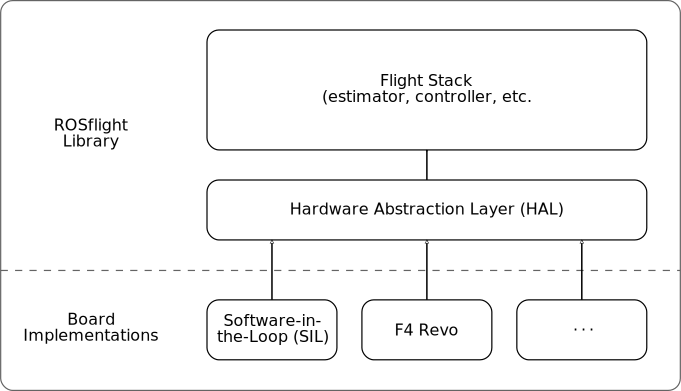

# ROSflight firmware code architecture

The firmware is divided into two main components: the _ROSflight library_, and a collection of _board implementations_.
This division is intended to allow the same core flight code to run on any processor or platform, either an embedded flight controller (such as the Naze32) or a desktop environment for a software-in-the-loop (SIL) simulation. The interface between these two components is called the _hardware abstraction layer_.
This architecture is illustrated in the following diagram:



The ROSflight library consists of all the code in the `include` and `src` directories of the firmware repository.
This includes the code for the what is termed the "flight stack," which consists of the core components (such as the estimator, controller, communication link, etc.) required for flight.
It also includes the interface definition for the hardware abstraction layer, which is defined by the abstract `Board` class in `include/board.h`.
External libraries (such as MAVLink) are contained in the `lib` folder.

The board implementations are contained in the `boards` directory, with each board contained in its own subdirectory (e.g. `boards/naze`).
Each board implementation is required to provide an implementation of the hardware abstraction layer interface, which is passed by reference to the flight stack.
The Naze32 implementation in the `boards/naze` shows how this is done for an embedded flight controller.
Examples of board implementations for SIL simulation are found in the `rosflight_firmware` and `rosflight_sim` ROS packages available [here](https://github.com/rosflight/rosflight).

The flight stack is encapsulated in the `ROSflight` class defined at `include/rosflight.h`.
This class contains two public functions: `init()` and `run()`.
Its constructor requires a single argument that is an implementation of the `Board` interface.
Each board implementation is required to provide its own `main()` function that instantiates an implementation of the `Board` interface, instantiates a `ROSflight` object with that board interface as an argument, calls the `init()` method of that `ROSflight` object once, then calls the `run()` method in a loop.
For example, here is the main function for the Naze32 board implementation (`board/naze/main.cpp`):

``` C++
#include "naze32.h"
#include "rosflight.h"

int main()
{
  rosflight_firmware::Naze32 board;
  rosflight_firmware::ROSflight firmware(board);

  firmware.init();

  while (true)
  {
    firmware.run();
  }
  return 0;
}
```

## Flight stack

The flight stack is encapsulated by the `ROSflight` class defined in `include/rosflight.h`.
It consists of a collection of _modules_.
Each of these modules is implemented as a C++ class, and encapsulates a cohesive piece of the autopilot functionality.
The following diagram illustrates these modules and the data flow between them.
Rectangular blocks represent modules in the flight stack, and ellipses represent hardware functionality implemented in the board support layer:


We'll describe each of these modules in the following sections:

### State manager
This module is in charge of keeping track of the internal state (armed status, error codes, failsafe, etc.) of the vehicle.
While only the MAVLink data flow is illustrated on the diagram, all other modules query the state manager to determine the status and act appropriately based on that status.

### Parameter server
This module handles all of the parameters for the flight stack.
It supports the getting and setting of integer and floating point parameters, and the saving of these parameters to non-volatile memory.
Setting and getting of parameters from the onboard computer is done through the MAVLink interface.
While no other data flow lines are shown on the diagram, all of the other modules interact with the parameter server.

### MAVLink
This module handles all serial communication between the flight controller and onboard computer.
This includes streaming data and receiving offboard control setpoints and other commands from the computer.
This module primarily collects data from the sensors, estimator, state manager, and parameters modules, and sends offboard control setpoints to the command manager and parameter requests to the parameter server.

### Sensors
This module is in charge of managing the various sensors (IMU, magnetometer, barometer, differential pressure sensor, sonar altimeter, etc.).
Its responsibilities include updating sensor data at appropriate rates, and computing and applying calibration parameters.

### Estimator
This module is responsible for estimating the attitude and attitude rates of the vehicle from the sensor data.

### RC
The RC module is responsible for interpreting the RC signals coming from the transmitter/receiver.
This includes mapping channels to their appropriate functions and reversing directions if necessary.

### Command manager
The command manager combines inputs from the RC and MAVLink modules to produce a control setpoint.
Its main purpose is to handle the interaction between offboard commands and the RC safety pilot, as well as to enforce the failsafe command if the state manager reports failsafe mode.

### Controller
The controller uses the inputs from the command manager and estimator to compute a control output.
This control output is computed in a generic form (\(x\), \(y\), and \(z\) torques and force \(F\)), and is later converted into actual motor commands by the mixer.

### Mixer
The mixer takes the generic outputs computed by the controller and maps them to actual motor commands depending on the configuration of the vehicle.
