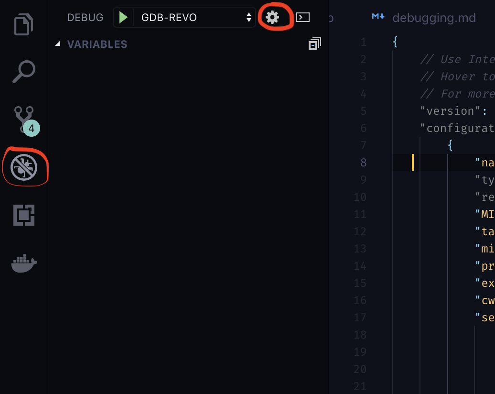

# Using an In-Circuit Debugger

Debugging a Naze32 is easiest with an ST-Link V2. You can find these on Amazon and other websites. The following guide will get you up and running with QtCreator or Visual Studio Code and the in-circuit debugger.

!!! warning
    We have had reports of problems with cheap clones of ST-Links not connecting.

## Add User to Dialout Group

!!! tip
    You can see which groups you are in by running `groups $USER` on the command line.

First, make sure you are in the `dialout` group. If you are not in the `dialout` group, run:

``` bash
sudo usermod -aG dialout $USER
```

Log out and back in for changes to take effect.

## Install IDE

### QtCreator

For some reason, the QtCreator bundled with 16.04 is unstable. Use the most recent build of QtCreator which can be downloaded [here](https://www.qt.io/download). If you are on 18.04, you can install via apt.


The following instructions are for installing Qt from the Qt provided installer:

This downloads a `.run` file; just make it exectuable and run as `sudo`:

```bash
cd ~/Downloads
chmod +x qt-unified-linux-x64-3.0.4-online.run
sudo ./qt-unified-linux-x64-3.0.4-online.run
```

If you want the icon to appear in your unity menu, create the following file as `~/.local/share/applications/qtcreator.desktop` (assuming that you installed qtcreator to the Qt folder in the installer)

```
[Desktop Entry]
Exec=bash -i -c /opt/Qt/Tools/QtCreator/bin/qtcreator.sh %F
Icon=qtcreator
Type=Application
Terminal=false
Name=Qt Creator
GenericName=Integrated Development Environment
MimeType=text/x-c++src;text/x-c++hdr;text/x-xsrc;application/x-designer;application/vnd.nokia.qt.qmakeprofile;application/vnd.nokia.xml.qt.resource;
Categories=Qt;Development;IDE;
InitialPreference=9
```

### VSCode

You can install Visual Studio Code by downloading the latest version from **[their website](https://code.visualstudio.com)**. The debugging tools provided by VSCode have been confirmed to work on both Mac and Linux.

## Install openocd

### For QtCreator

Open OCD (On-Chip-Debugger) is the software that will control the debugger. We are going to install the version that is configured to work as a plugin for the eclipse IDE. To get this version, go to the **[releases](https://github.com/gnuarmeclipse/openocd/releases)** page of the OpenOCD github page and download the latest `.tgz` file. You can use the following commands, substituting the version you downloaded for <version>:


```bash
cd ~/Downloads
tar -xvf gnuarmeclipse-openocd-<version>-dev.tgz
sudo mv openocd /opt/
```

Then, for convenience, I normally create a script to run openocd for me. Here is my `start_openocd_f1` script:

``` bash
#!/bin/bash
cd /opt/openocd/0.10.0-201701241841/bin # Use the correct version
./openocd -f interface/stlink-v2.cfg -f target/stm32f1x.cfg
```

Here is my `start_openocd_f4` script:

``` bash
#!/bin/bash
cd /opt/openocd/0.10.0-5-20171110-1117/bin
./openocd -f interface/stlink-v2.cfg -f target/stm32f4x.cfg
```

!!! Note
    On more recent versions of openocd, `interface/stlink-v2.cfg` is deprecated. Use `interface/stlink.cfg` instead.

I move these to the `/usr/local/bin` directory so I can call it from anywhere:

``` bash
chmod +x start_openocd_f1
chmod +x start_openocd_f4
mv start_openocd_f1 /usr/local/bin
mv start_openocd_f4 /usr/local/bin
```

### For VSCode

For VSCode, install the openocd version currently available through your package manager:

Ubuntu:
```bash
sudo apt install openocd
```

Mac:
```bash
brew install open-ocd
```

The `start_openocd_f4` script requires a few additional parameters to ensure proper connection to VSCode and GDB:

```bash
#!/bin/bash
cd /opt/openocd/0.10.0-11-20190118-1134/bin
./openocd -f interface/stlink.cfg -f target/stm32f4x.cfg -c "gdb_port 50250" -c init -c "reset init"
```

As shown above, this script can be added to your `/usr/local/bin` if you want to be able to call it from anywhere.

## Install ARM compiler and 32-bit Dependencies

Follow the guide in [Building and Flashing](/developer-guide/building-flashing) to install the compiler.

QtCreator also needs 32-bit python bindings to run GDB (skip this if using VSCode)

``` bash
sudo dpkg --add-architecture i386
sudo apt update
sudo apt install libpython2.7:i386
```

## Configure QtCreator for ARM Development

Open up the new QtCreator you just installed (make sure it's the new one, and not the version you get from `apt`)

### Turn on the "Bare Metal Plugin"

Help -> About Plugins -> Enable "Bare Metal"

Restart QtCreator

Now, we are going to configure a new "Kit" for ARM development. (This allows you to quickly switch back and forth between ARM and normal development.)

### Tell QtCreator where to find the compiler (GCC)

* Tools -> Options -> Build & Run -> Compilers -> Add -> GCC -> C++.
* Name the new compiler, e.g. "G++ ARM"
* Point the compiler path to where you just installed your fresh GCC
  * The path for G++ `/opt/gcc-arm-none-eabi-5_4-2016q3/bin/arm-none-eabi-g++`

Do the same for GCC (if you are going to be doing any C-only code)

* Tools -> Options -> Build & Run -> Compilers -> Add -> GCC -> C.
* Name the compiler, e.g. "GCC ARM"
* Point the compiler path to where you just installed your fresh GCC
  * The path for GCC is `/opt/gcc-arm-none-eabi-5_4-2016q3/bin/arm-none-eabi-gcc`


### Add the Debugger (GDB)

* Tools -> Options -> Build & Run -> Debuggers -> Add -> GDB.
* Name it something
* Point it to the new debugger you just installed
  * The Path for `/opt/gcc-arm-none-eabi-5_4-2016q3/bin/arm-none-eabi-gdb-py`


### Configure the STLink-V2 with OpenOCD

Go to the Bare Metal Plugin

* Tools -> Options -> Devices -> Bare Metal -> Add -> OpenOCD
* Leave all options at default values and click Apply

* Tools -> Options -> Devices -> Devices -> Add -> Bare Metal Device -> Start Wizard
* **Name:** ST-Link V2
* **GDB Server Provider:** OpenOCD


### Build the new Development Kit

* Tools -> Options -> Build & Run -> Kits -> Add
* Name: ARM
* Device Type: Bare Metal Device
* Device: ST-Link V2
* Compiler: GCC ARM/G++ ARM
* Debugger: ARM GDB
* Qt Version: None


## Configure VSCode for ARM Development

Open the debugger launch.json file by navigating to the Debug pane (Ctrl + Shift + D) and clicking the gear at the top of the screen:



Add a configuration entry to the launch.json file that looks something like this (be sure to substitute the correct folder name for your version of the gcc-arm compiler):

```json
{
    "name": "GDB-REVO",
    "type": "cppdbg",
    "request": "launch",
    "MIMode": "gdb",
    "targetArchitecture": "arm",
    "miDebuggerPath": "/opt/gcc-arm-none-eabi-5_4-2016q3/bin/arm-none-eabi-gdb",
    "program": "${workspaceRoot}/boards/airbourne/build/rosflight_REVO_Debug.elf",
    "externalConsole": false,
    "cwd": "${workspaceRoot}",
    "setupCommands": [
        { "text": "file ${workspaceRoot}/boards/airbourne/build/rosflight_REVO_Debug.elf" },
        { "text": "set remotetimeout 30" },
        { "text": "target remote localhost:50250" },
        { "text": "monitor halt" },
        { "text": "monitor reset init" },
        { "text": "load" },
        { "text": "info target" }
    ],
}
```

Note that you will need to change the `program` and first `setupCommands.text` entries if you want to run a different example or version of the firmware.

With a board plugged in and openocd running, you should now be able to press Play on the debug screen and launch the firmware in debug mode!

If you do not want to call `make` from the terminal for every change, you can also create a simple task in VSCode to do it for you. Open tasks.json from Command Pallette -> Tasks: Configure Task

```json
{
    "label": "build",
    "type": "shell",
    "command": "make"
}
```

## Test the Debugger

Here are the instructions for an F1 target. The instructions are very similar for an F4, just choose the correct `.elf` file.

### Turn on the Debugger

Connect the debugger to your flight controller. Here is the pinout for the Flip32 and Flip32+:


Plug in the debugger and start openocd (you will need sudo privileges):

`sudo start_openocd_f1`

### Build the Correct Example Code

* Import Existing Project
* Open the root of the firmware
* Do _**not**_ add .creator files to the Git repository

### Configure the Build Environment

* Go to the "Projects" tab on the left hand side
* Switch to the ARM Kit we just created
* Build Settings:
    * Change "Build Directory" to the firmware root
    * Build Steps: `make BOARD=NAZE DEBUG=GDB`

* Run Settings:
    * Change "Run Configuration" to hardware debugger
    * Choose the `.elf` file in the `boards/breezy/build` directory (you'll need to build first) `firmware/boards/breezy/build/rosflight.elf`


You're done!  Just select the "Debug" tab and debug your project!
