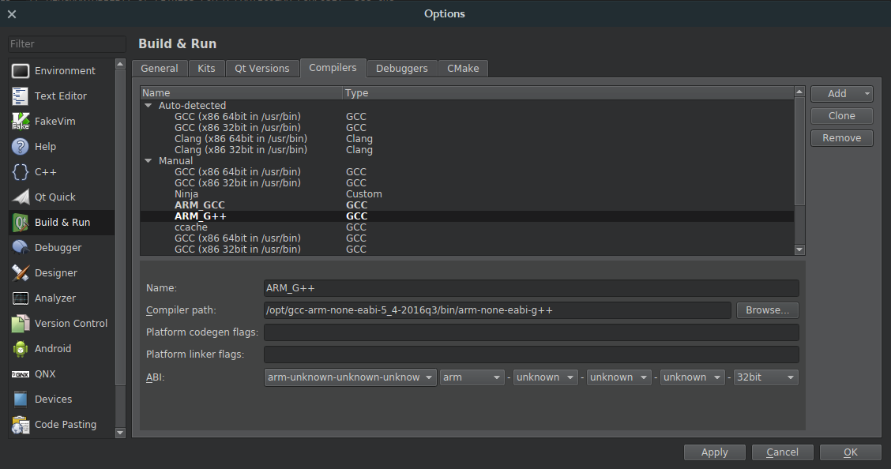
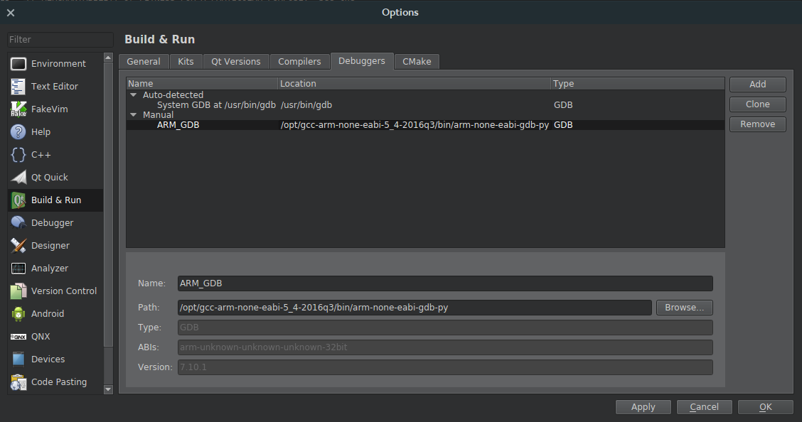
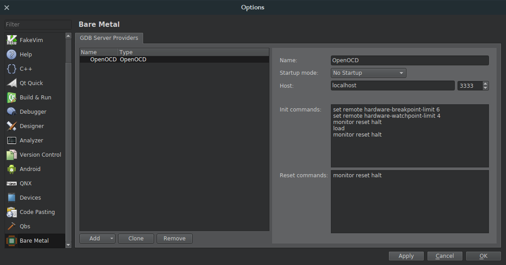
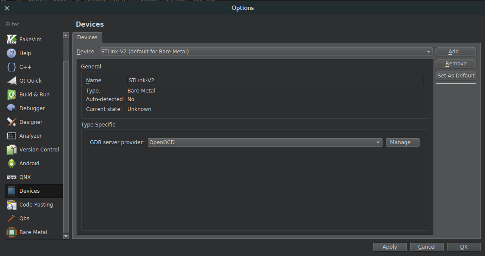
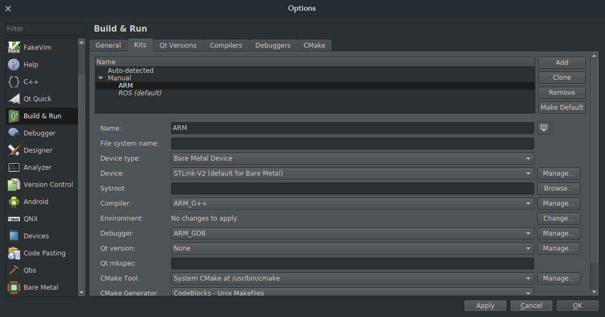
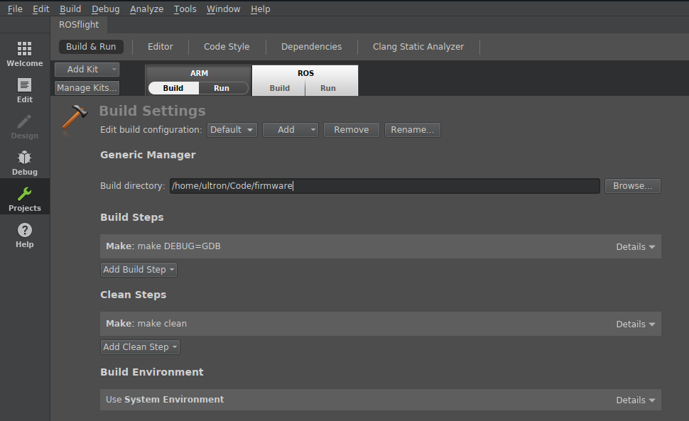

# Using an In-Circuit Debugger with a Naze32 (and variants)

Debugging a naze32 is easiest with an ST-Link V2.  You can find these on Amazon and other websites. The following guide will get you up and running with QtCreator and the in-circuit debugger.

_** We have had reports of problems with cheap clones of ST-Links not connecting.  Consider yourself warned. **_

_**It appears that perhaps debugging only works with Ubuntu 16.04 because of some issues with gdb-py and the "textinfo" tool in 14.04.**_

## Add User to Dailout Group

First, make sure you are in the `dialout` group:

``` bash
sudo adduser $USER dialout
```

Log out and back in for changes to take effect.

## Install QtCreator 4.1.0

For some reason, the QtCreator bundled with 16.04 is unstable.  4.2.0 messes up ROS workspaces, so the most recent stable build for use with ROS and debugging is 4.1.0.  Download it from [here](https://download.qt.io/official_releases/qtcreator/4.1/4.1.0/installer_source/linux_gcc_64_rhel66/qtcreator.7z).

This downloads a `.7z` file, which requires `p7zip` to extract.  After downloading extract and install qtcreator:

```bash
sudo apt-get install p7zip-full
cd ~/Downloads
mkdir qtcreator
mv qtcreator.7z qtcreator/.
cd qtcreator
p7zip -d qtcreator.7z
cd ..
sudo mv qtcreator /opt/.
sudo ln -s /opt/qtcreator/bin/qtcreator /usr/bin/.
```

If you want the icon to appear in your unity menu, create the following file as /usr/share/applications/qtcreator.desktop

```
[Desktop Entry]
Exec=bash -i -c qtcreator %F
Icon=qtcreator
Type=Application
Terminal=false
Name=Qt Creator
GenericName=Integrated Development Environment
MimeType=text/x-c++src;text/x-c++hdr;text/x-xsrc;application/x-designer;application/vnd.nokia.qt.qmakeprofile;application/vnd.nokia.xml.qt.resource;
Categories=Qt;Development;IDE;
InitialPreference=9
```


## Install openocd

Open OCD (On-Chip-Debugger) is the software that will control the debugger.  We are going to install the version that is configured to work as a plugin for the eclipse IDE.  To get this version, go to the **[releases](https://github.com/gnuarmeclipse/openocd/releases)** page of the OpenOCD github page and download the latest `.tgz` file


```bash
cd ~/Downloads
tar -xvf gnuarmeclipse-openocd-debian32-0.10.0-201610281609-dev.tgz (or whatever)
sudo mv openocd /opt/.
```

Then, for convenience, I normally create a script to run openocd for me.  Here is my `start_openocd_f1` script

``` bash
#!/bin/bash

cd /opt/openocd/0.10.0-201701241841/bin
./openocd -f interface/stlink-v2.cfg -f target/stm32f1x.cfg
```

which I move to the `~/.local/bin` directory so I can call it from anywhere:

``` bash
chmod +x start_openocd_f1
mv start_openocd_f1 ~/.local/bin
```

## Install ARM compiler and 32-bit Dependencies

Follow the guide in [Building and Flashing](/developer-guide/building-flashing.md) to install the compiler.

QtCreator also needs 32-bit python bindings to run GDB

``` bash
sudo dpkg --add-architecture i386
sudo apt-get update
sudo apt-get install libpython2.7:i386
```

## Configure QtCreator for ARM Development

Open up the new QtCreator you just installed (make sure it's the new one, and not the version you get from `apt-get`)

### Turn on the "Bare Metal Plugin"

Help -> About Plugins -> Enable "Bare Metal"

Restart QtCreator

Now, we're going to configure a new "Kit" for ARM development (this allows you to quickly switch back and forth between ARM and normal development)

### Tell QtCreator where to find the compiler (GCC)

* Tools -> Options -> Build & Run -> Compilers -> Add -> GCC -> C++.  
* Name the new compiler "G++ ARM" (or something)
* Point the compiler path to where you just installed your fresh GCC.
* The path for G++ `/opt/gcc-arm-none-eabi-5_4-2016q3/bin/arm-none-eabi-g++`

Do the same for GCC (if you are going to be doing any C-only code)

* Tools -> Options -> Build & Run -> Compilers -> Add -> GCC -> C.  
* Name the compiler (I named my compiler "GCC ARM)
* The path for GCC is `/opt/gcc-arm-none-eabi-5_4-2016q3/bin/arm-none-eabi-gcc`



### Add the Debugger (GDB)

* Tools -> Options -> Build & Run -> Debuggers -> Add -> GDB.
* Name it something
* Point it to the new debugger you just installed
* The Path for `/opt/gcc-arm-none-eabi-5_4-2016q3/bin/arm-none-eabi-gdb-py`



### Configure the STLink-V2 with OpenOCD

Go to the Bare Metal Plugin

* Tools -> Options -> Devices -> Bare Metal -> Add -> OpenOCD
* Leave all options at default values and click Apply

* Tools -> Options -> Devices -> Devices -> Add -> Bare Metal Device -> Start Wizard
* **Name:** ST-Link V2
* **GDB Server Provider:** OpenOCD



### Build the new Development Kit

* Tools -> Options -> Build & Run -> Kits -> Add
* Name: ARM
* Device Type: Bare Metal Device
* Device: ST-Link V2
* Compiler: GCC ARM/G++ ARM
* Debugger: ARM GDB
* Qt Version: None




## Test the Debugger

### Turn on Debugger

Connect the Debugger to your flight controller.  Here is the pinout for the Flip32 and flip32+


Plug in the debugger and start openocd (you'll need sudo privileges)

`sudo start_openocd_f1`

### Build the Correct Example Code

* Import Existing Project
* Open the root of the firmware
* Do _**not**_ add .creator files to the Git repository

### Configure the Build Environment

* Go to the Projects Tab on the left hand side
* Switch to the ARM Kit we just created
* Build Settings:
    * Change Build Directory to the firmware root
    * Build Steps: `make DEBUG=GDB`

* Run Settings:
    * Change Run Configuration to hardware debugger
    * Choose the `.elf` file in the `boards/naze/build` directory (you'll need to build first) `.../firmware/boards/naze/build/rosflight.elf`


You're done!  Just select the Debug tab and debug your project!
