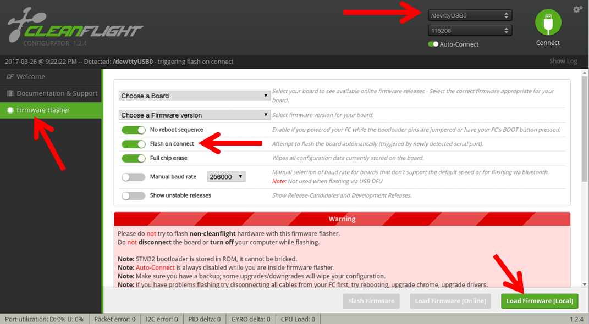
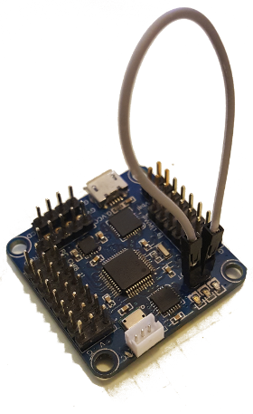
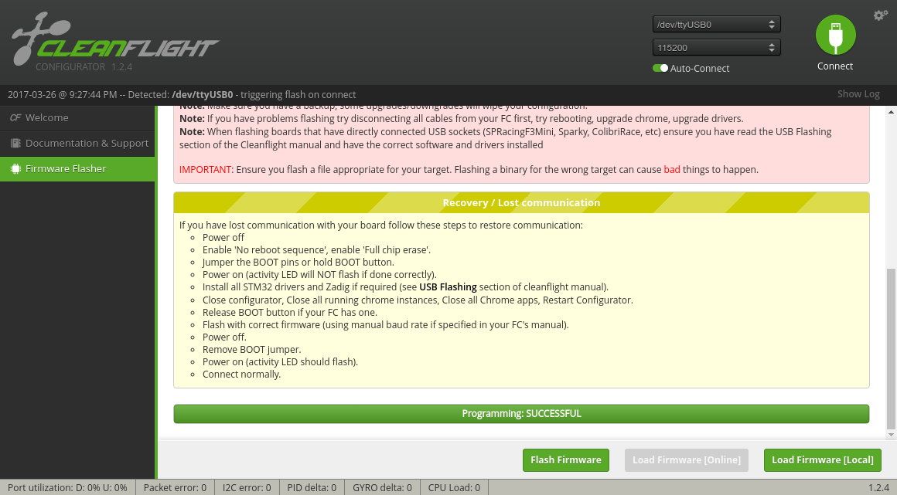

# Compatible hardware

As of June 2017 ROSflight is only supported on flight controllers with STM32F103 processors, specifically, the naze32 and the flip32.  Both the 6-DOF and 10-DOF versions of each board are fully supported.  We have had most success with flip32 boards purchased directly from [readytoflyquads.com](http://www.readytoflyquads.com/).  We have had weird issues with knock-off boards from Chinese vendors.

# Flashing firmware using the Cleanflight Configurator

* Download the latest version of ROSflight [here](https://github.com/rosflight/firmware/releases).
* Install the cleanflight configurator - It is an extension to Google Chrome - [link](https://chrome.google.com/webstore/detail/cleanflight-configurator/enacoimjcgeinfnnnpajinjgmkahmfgb?hl=en)
* Be sure your user is in the `dialout` group so you have access to the serial ports
* Load the firmware and flash using cleanflight configurator

    * Open the configurator, open firmware flasher.  Connect your flight controller, and make sure that you have selected the right port.  Then select "Load Firmware (Local)" and  select your .hex file you downloaded earlier.

    * Short the boot pins on your flight controller, unplug it, and and plug back in.

* If you scroll to the bottom of the screen, you will then see the green bar indicate progress as the hex is flashed to the flight controller.  You should then see something like the following


* You're done!  Great job


# Flashing Firmware using stm32flash (CLI Linux)

You can also use stm32flash to flash firmware.  This is helpful if you need (or prefer) a command-line interface.

* Download and install stm32flash
``` bash
git clone git://git.code.sf.net/p/stm32flash/code stm32flash-code
cd stm32flash-code
sudo make install
cd ..
rm -rf stm32flash-code
```
* Make sure you are in the dialout group (same instructions as above)
* Short boot pins, restart the naze (by unplugging and plugging back in)
* Download the latest rosflight.hex file [here](https://github.com/rosflight/firmware/releases).
* Flash the firmware to the proper device (replace `/dev/ttyUSB0`)
``` bash
    stm32flash -w rosflight.hex -v -g 0x0 -b 921600 /dev/ttyUSB0
```
