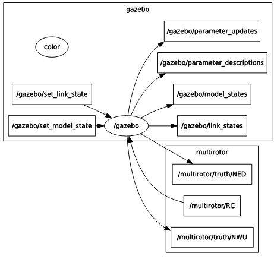
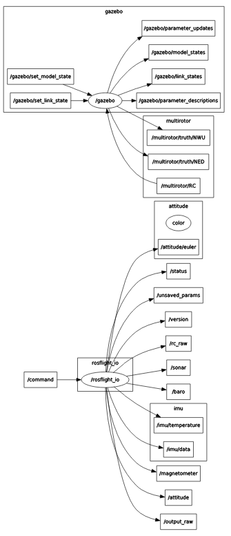

# Running Simulations in Gazebo

One useful tool that comes with rosflight is the ability to perform software-in-the-loop (SIL) simulations of the ROSflight firmware in gazebo.

## Architecture of the SIL simulation

To best mimic the hardware experience of ROSflight, the SIL plugin for gazebo actually implements the firmware source code as a library.  We just implemented a different "board layer" which instead uses gazebo instead of hardware calls for things like "read_imu" and "pwm_write".  Instead of a serial link over USB to the flight controller, we use a UDP connection bouncing off of localhost to communicate between `rosflight_io` and the firmware.  This means the interface to the SIL plugin is identical to that of hardware.  `rosflight_io` is the main gateway to the firmware in simulation, just as it is in hardware.

Here is an illustration comparing all the connections in hardware and RC.


## Quick Start Guide To SIL Simulation

* create a catkin workspace

* clone the `rosflight` metapackage repository from [github](https://github.com/rosflight/rosflight) into your workspace

* clone submodules of the `rosflight` metapackage (``` git submodule update --init --recursive ```)

* clone the `rosflight_joy` metapackage repository from [github](https://github.com/rosflight/rosflight_joy) into your workspace

* install pygame `sudo pip install pygame`

* Perform a `catkin_make`

* `roslaunch rosflight_sim multirotor.launch` - This will open up a gazebo simulation, and you should have the following `rqt_graph`



* At this point, you can't actually do anything, because there is no RC connection and no `rosflight_io` to talk to the firmware.  Let's start by running a `rosflight_io` node.  In a separate terminal, run `rosrun rosflight rosflight_io _udp:=true`.
    * The `udp` parameter tells `rosflight_io` to simulate a serial connection over UDP rather than using the USB connection to hardware
Your `rqt_graph` should look something like the following image. This looks funny, because ROS doesn't actually know that there is a UDP connection between `rosflight_io` and gazebo.  There is one, though, you can test it by echoing any of the topics published by `rosflight_io`.




* Spin up a simulated RC connection.   The easiest way to do this is with the helper package `rosflight_joy`.  Connect a joystick to the computer (or Taranis transmitter) and run `rosrun rosflight_joy rc_joy RC:=/multirotor/RC`.  This simulates the RC connection in hardware.  If everything is mapped right, you should now be able to arm, disarm and fly the aircraft in simulation!

*__note: it is much easier to fly with a real transmitter than with an xbox-type controller.  Realflight transmitters and interlinks are also supported.  Non-Xbox joysticks may have incorrect mappings.  If your joystick doesn't work and you write your own mapping, please contribute back your new joystick mappings__*

Remember, the SIL tries its best to replicate hardware.  That means you have to calibrate and set parameters in the same way you do in hardware.  See the hardware setup and parameter configuration pages in this documentation to see how to perform all preflight configuration before the aircraft will arm.

As a quick help, here is a roslaunch file which quickly does all the above `rosrun` steps automatically:

``` xml
<launch>
  <arg name="mav_name"            value="multirotor"/>

  <arg name="color"               default="White"/>
  <arg name="x"                   default="0"/>
  <arg name="y"                   default="0"/>
  <arg name="z"                   default="0.2"/>
  <arg name="yaw"                 default="0"/>
  <arg name="paused"              default="false"/>
  <arg name="gui"                 default="true"/>
  <arg name="verbose"             default="false"/>
  <arg name="debug"               default="false"/>

  <include file="$(find rosflight_sim)/launch/base.launch">
    <arg name="mav_name" value="$(arg mav_name)"/>
    <arg name="color" value="$(arg color)"/>
    <arg name="x" value="$(arg x)"/>
    <arg name="y" value="$(arg y)"/>
    <arg name="z" value="$(arg z)"/>
    <arg name="yaw" value="$(arg yaw)"/>
    <arg name="paused" value="$(arg paused)"/>
    <arg name="gui" value="$(arg gui)"/>
    <arg name="verbose" value="$(arg verbose)"/>
    <arg name="debug" value="$(arg debug)"/>
    <arg name="xacro_file" value="$(find rosflight_sim)/xacro/multirotor.urdf.xacro"/>
    <arg name="param_file" value="$(find rosflight_sim)/params/multirotor.yaml"/>
  </include>

  <node name="rosflight_io" pkg="rosflight" type="rosflight_io" output="screen">
    <param name="udp" value="true"/>
  </node>

  <node name="rc_joy" pkg="rosflight_joy" type="rc_joy">
    <remap from="RC" to="multirotor/RC"/>
  </node>

</launch>
```

To simulate a fixedwing mav, just change all instances of `multirotor` in the above steps to `fixedwing`.
