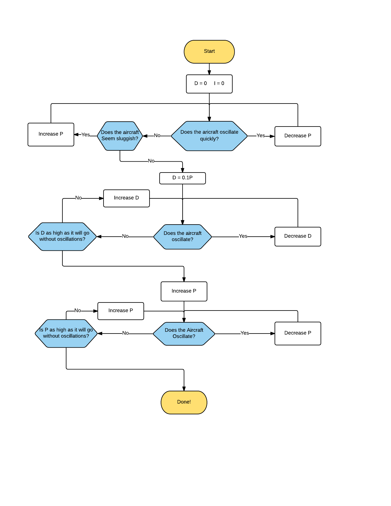

# Multirotor gain tuning

Becuase there are a wide variety of multirotors out there, no one set of PID controller gains will work for all vehicles.  The default set of gains is relatively conservative for most platforms, and should be somewhat airworthy in most cases, however, depending on the inertia to torque ratio for your MAV, you may have to change these gains considerably.  There are some great tutorials online on multirotor gain tuning, however since this is the ROSflight documentation, I'll put my tuning method here for you.

If you are unfamiliar with PIDs, then you should probably go read about them before trying to tune a multirotor.  Getting an understanding for what is going on will definitely guide your decision making process as you try to figure out better gains.

Some people like to build test stands to tune multirotors.  This is probably a good idea.  However, I've never used one of these stands and I've tuned multirotors that weigh several times as much as I do without one.  It is definitely not necessary.  However, in most cases, I have added what I call "training wheels" to the multirotors I'm tuning, which amounts to thin carbon rods in the shape of an X zip-tied to the landing gear.  This widens out the base of the quadcopter so if you come down on a hard oscillation, chances are you'll end up upright, hopefully without a prop strike.

### Tuning Roll and Pitch Controllers

Here is a flowchart describing my PID tuning process for roll and pitch:

You may want to do another D-tuning iteration, and sometimes it is helpful to do a little tweaking to eek out a little performance from the differences in roll and pitch dynamics.

Notice, I didn't include any I tuning.  As a general rule, try to keep the I gain as low as possible.  It will _always_ slow your reponse rate to input, and it can induce low frequency oscillations.  

You should _only_ have I gain on roll and pitch if

1. You expect your CG to change or 
2. you expect your rotor geometry to change.  
 
This is pretty rare.  Instead, use your RC transmitter to trim the aircraft so it hovers on no stick input.  In the next section will use the RC trim to calculate a feed-forward torque on roll, pitch and yawrate.

### Tuning Yawrate

Dynamically and algorithmically speaking, there is really not much advantage to using a D gain in yawrate.  Controlling with derivative requires differentiating gyro input, which tends to be pretty noisy.  In our experience, putting D in rate controllers on multirotors has always decreased performance.

Tuning Yawrate is generally pretty easy, basically, keep cranking it up until you feel like it's "locked in".  Sometimes a little bit of I (on the order of 0.1P) can help with this as well.

The problem with too much P on yawrate generally manifests itself in motor saturation.  Some, especially larger, multirotors have problems getting enough control authority in yaw with the propellers being aligned flat.  After you're done tuning, you might want to look at a plot of motor outputs during a fairly agressive flight.  Underactuated yaw will be pretty obvious in these plots, because you'll see the motor outputs railing.  To fix this, you can put shims underneath the motors to tilt the motors just a little bit in the direction of yaw for that motor.

# RC trim calculation

In the vast majority of cases, your multirotor will not be built perfectly.  The CG could be slightly off, or your motors, speed controllers and propellers could be slightly different.  One way to fix this is by adding an integrator.  Integrators get rid of static offsets like what we are talking about. However, as mentioned above, integrators also always slow your response. In our case, since this offset is going to be constant, we can instead find some "feed-forward" or equilibrium offset torque that you need to apply to hover exactly.

Use the RC transmitter to find the "equilibrium torques" about the x, y, and z axes to keep the multirotor level.  This is done by trimming the aircraft with the RC trims.  These are usually the little switches next to sticks on your transmitter.  Adjust these until you can hover the multirotor without touching the sticks.

Next, land the multirotor, disarm, center the sticks and perform an rc calibration `rosservice call /calibrate_rc_trim`.  ROSflight then uses the trim settings on your transmitter to find these equilibrium or feed-forward torques that need to be applied post-controller to keep the multirotor level.  These torques will be applied to all future commands, so you will need to zero out your transmitter trims after calibration.

