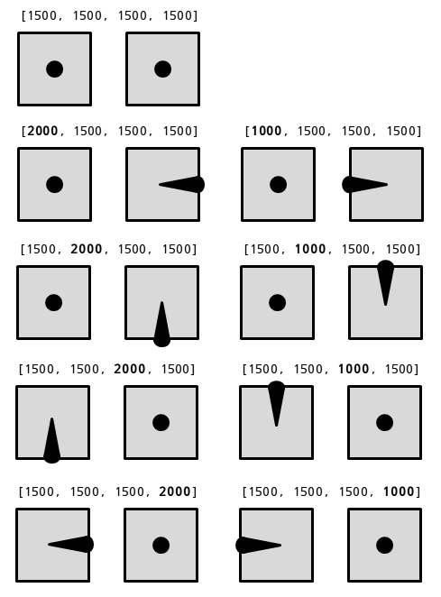

# Binding your Transmitter to your Receiver

We have had the most success using PPM receivers.  Parallel PWM recievers are also supported, but they actually require more effort on the part of the flight controller and can occasionally cause I2C errors.

Follow the instructions in your user manual to bind your transmitter to your RC receiver.  You may also be able to find a guide on YouTube with instructions, just search for your particular transmitter and recevier model.

# RC Calibration

To avoid confusion and to reduce code complexity in the firmware source, ROSflight does not perform software calibration of RC transmitters.  This means that RC calibration must be done on the transmitter itself, as opposed to in software.  This is pretty straight-forward in most modern transmitters.  To successfully calibrate you have to do the following:

## Configure the full stick output for each channel

The easiest way to this is to enter the "Servo Setup" Menu (for Spektrum transmitters) and change the servo travel variable.  You can watch the raw RC readings from the flight controller by echoing the rc_raw topic from `rosflight_io`

```
rostopic echo /rc_raw
```

* center both sticks on your transmiterr
* Apply subtrim until the first four channels all read 1500 exactly (or as close a possible, some RC recievers are worse than others and cannot exactly output 1500)
* Set the channel endpoints so that maximum stick deflections result in readings of 1000 and 2000 us.

Until we get a video of this for our system, you may want to follow this YouTube guide for channel calibration in betaflight [Calibrating RC endpoints with Taranis X9D](https://www.youtube.com/watch?v=nDsNWZgxmw4&t=186s).

## Configure stick direction for roll, pitch, and yaw channels.

You now have to make sure your RC transmitter is sending commands consistent with the north-east-down (NED) frame assumed by ROSflight.

You may find this graphic helpful.  It shows all the basic stick positions, and the associated output from the first four channels when looking at a raw AETR RC signal from `rosflight_io`.  Make sure that the stick output is in the right direction.



It should be noted, that channel assignment can be modified via the `RC_*_CHN` parameters.  So if you are using something other than AETR assignment, the channel index for each stick may be different, but the direction should be the same.
